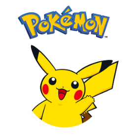
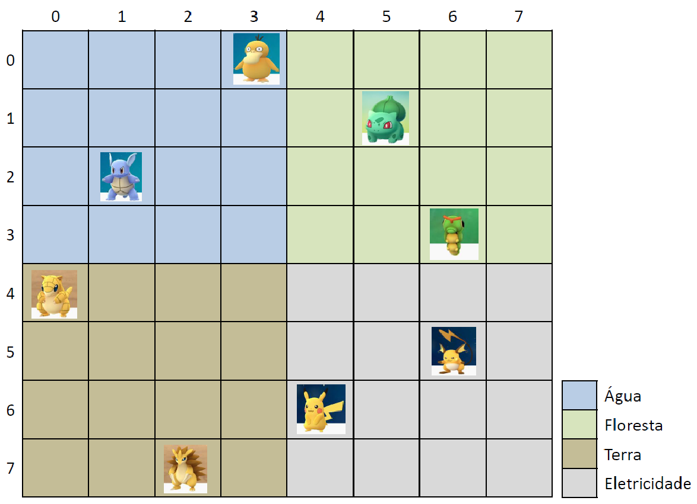

<p align="center">
  
</p>

> **UNIVERSIDADE FEDERAL DE PELOTAS**  
> **Disciplina:** Programação Orientada a Objetos - 2025/1  
> **Professores:** Felipe Marques, Rafael Burlamaqui

# TRABALHO DE IMPLEMENTAÇÃO

> **INTEGRANTES DO GRUPO:** Gustavo dos Santos Leon, [...]

## DESCRIÇÃO GERAL

> O trabalho consiste em implementar o jogo Pokémon utilizando a linguagem Java.  
> Seu programa precisa ter uma interface gráfica.  
> Todos os passos para a construção do programa deverão ser descritos em um relatório.

<p align="center">
  
</p>

## DESCRIÇÃO DO JOGO

Pokémon é uma franquia da [_The Pokémon Company_](https://pt.wikipedia.org/wiki/The_Pok%C3%A9mon_Company), criada em 1995 por [Satoshi Tajiri](https://pt.wikipedia.org/wiki/Satoshi_Tajiri).  
O jogo é centrado em [criaturas ficcionais chamadas de "Pokémon"](https://pt.wikipedia.org/wiki/Lista_de_Pok%C3%A9mon), que podem ser capturadas e treinadas por seres humanos para lutarem uma contra a outra como um esporte.

Os jogadores deste jogo são chamados de **Treinadores Pokémon** e dois dos principais objetivos (na maioria dos jogos Pokémon) são:

1. Completar a Pokédex, capturando todas as espécies Pokémon disponíveis;
2. Treinar seu time de Pokémon para competir contra o time de outros Treinadores e, eventualmente, se tornar o mais forte Treinador: um Mestre Pokémon.

Os conceitos de capturar, treinar e batalhar estão presentes em quase todas as versões da franquia Pokémon (nos [jogos](<https://pt.wikipedia.org/wiki/Pok%C3%A9mon_(s%C3%A9rie_de_jogos_eletr%C3%B4nicos)>), no [anime](<https://pt.wikipedia.org/wiki/Pok%C3%A9mon_(anime)>), na série de mangá e no [jogo de cartas](https://pt.wikipedia.org/wiki/Pok%C3%A9mon_Trading_Card_Game)).

Quando um Pokémon não pertence a algum Treinador, este é chamado de **Pokémon selvagem**. Este Pokémon pode ser capturado por um Treinador utilizando um objeto esférico chamado Pokébola. Os Treinadores podem mandar seus Pokémon para batalhas contra outros Pokémon. Se um Pokémon derrota o adversário durante uma batalha, então o oponente é nocauteado (ou seja, "desmaia"). O Pokémon vencedor ganha pontos de experiência e, às vezes, pode subir de nível.

<p align="center">
  
</p>

O jogo que deve ser implementado é uma variante do jogo original, pois possui características específicas e diferentes. Os Pokémons estarão dispersos em uma área retangular dividida em células, semelhante a uma tabela (Veja a Figura 1). Uma célula poderá conter um Pokémon ou não. Esta área também terá uma subdivisão para representar as regiões específicas dos tipos de Pokémon existentes. Em cada jogada, o jogador deverá escolher uma célula em busca de Pokémon. Se um Pokémon selvagem for encontrado, a Pokébola será usada para tentar capturá-lo. Caso o Pokémon encontrado seja de outro Treinador, uma batalha será realizada entre eles. Nesta versão do jogo, o Pokémon vencedor também ganha pontos de experiência. Estes pontos serão atualizados a cada jogada para indicar o jogador ganhador até o momento. O jogo termina quando todos os Pokémon disponíveis tiverem sido capturados. Para o primeiro caso, o jogador vencedor será o que possuir o time Pokémon com maior pontuação de experiência.

---

## DESCRIÇÃO DAS ATIVIDADES DESTE TRABALHO

### CARACTERÍSTICAS DO JOGO QUE SERÁ DESENVOLVIDO

- A tela do jogo é dividida em uma tabela com **N linhas e N colunas**.  
  A tabela será dividida em 4 regiões, onde cada região possui Pokémons específicos.  
  Cada Pokémon será posicionado em uma célula deste tabuleiro respeitando sua região.

  > **OBS:** De forma semelhante à Figura 1, o usuário só poderá visualizar os Pokémon do seu time.

  - **Região 1 (Água):** linhas de 0 a (N/2-1), colunas de 0 a (N/2-1).
  - **Região 2 (Floresta):** linhas de 0 a (N/2-1), colunas de N/2 a (N-1).
  - **Região 3 (Terra):** linhas de N/2 a (N-1), colunas de 0 a (N/2-1).
  - **Região 4 (Eletricidade):** linhas de N/2 a (N-1), colunas de N/2 a (N-1).

- O jogo possui **2 treinadores**: usuário e computador.  
  As jogadas do computador são geradas aleatoriamente.

- Cada treinador possui:

  - um time Pokémon, inicialmente possui apenas um Pokémon
  - uma mochila para armazenar Pokémons
  - a pontuação do time

  E poderá:

  - escolher uma célula em busca de Pokémon;
  - capturar um Pokémon;
  - batalhar contra um Pokémon adversário.

- Um Pokémon possui as seguintes características (lista não exaustiva):

  - energia
  - força
  - pontos de experiência
  - nível
  - tipo (água, terra, …)
  - situação (selvagem ou oficialmente do treinador)

  E poderá:

  - **atacar outro Pokémon:** consiste em gerar um valor de ataque de acordo com sua força, nível e experiência  
    (Por exemplo, `valor_ataque = random(força)*nível + experiência`);  
    Obs: `random(força)` pode ser uma função que gera um número aleatório que contenha no máximo o valor da força.  
    Mas note que isso não está fixo na descrição, é apenas um exemplo!
  - **aumentar os pontos de experiência:** consiste em atualizar seus pontos com as vitórias em batalhas;
  - **avançar de nível:** consiste em incrementar o nível se o Pokémon alcançar uma pontuação pré-estabelecida de experiência.  
    Isto potencializará o ataque.

- Existem **4 tipos de Pokémon**, cada tipo realiza o ataque a outro Pokémon de forma diferente:

  - **Pokémon Floresta:** habilidade de regeneração (cura parte do dano ao atacar).
  - **Pokémon Terra:** ataque com força dobrada em turno ímpar.
  - **Pokémon Elétrico:** chance de paralisar o adversário por 1 rodada (usando lógica com Random).
  - **Pokémon Água:** redução de dano recebido em ambientes adversos.

- Cada quadrado (célula) da grade/tabela deve ser um botão, a ser clicado no momento da busca por Pokémon.  
  Ao clicar no botão, o botão deve desvendar o que tem na célula (nada ou um Pokémon) e realizar a ação associada.

- A interface deve ter botões para “iniciar uma nova partida”.

---

## ATIVIDADE 1

Criar uma janela de boas vindas para o jogador e perguntar se ele pretende:

- **Carregar um jogo salvo**
- **Posicionar seu time Pokémon**
- **Distribuir Pokémons de maneira aleatória**

#### Carregar Jogo Salvo

- O usuário precisa indicar o arquivo para carregar todos os dados.

#### Definir Posição

- Mostrar uma grade/tabela de botões, selecionar o Pokémon a ser carregado e marcar na tabela o Pokémon através do clique na posição desejada (ao clicar no botão, este deve ser desabilitado e o Pokémon marcado nesta posição).  
  Lembrando que as regiões da tabela devem ser respeitadas para cada tipo de Pokémon.  
  Por exemplo, se o Pokémon a ser posicionado for de Água, uma exceção será gerada e o personagem deverá ser realocado.
- Após o posicionamento dos Pokémon do time de cada jogador (jogador e computador), o programa deve posicionar o restante dos Pokémon disponíveis.
- Ofereça uma opção **“DEBUG”**, onde o usuário poderá indicar a posição de todos os pokémons.

#### Posição Aleatória

- O programa deverá gerar a tabela com todos os Pokémon disponíveis em posições aleatórias, respeitando suas regiões dentro da tabela.  
  As exceções devem ser tratadas automaticamente pelo computador, se gerar em posição incorreta.

---

## ATIVIDADE 2

Após posicionar os Pokémon, o jogador deve clicar em um botão para prosseguir (por exemplo, o nome do botão poderia ser “Jogar”).  
Ao clicar neste botão, uma nova janela deve ser criada com a grade/tabela de botões do jogo.

Esta tela também deve conter as seguintes opções:

- **Trocar Pokémon Principal:**  
  Se o treinador possuir mais Pokémons em sua mochila, poderá escolher outro para realizar e receber os ataques.

- **Dica:**  
  O jogador informa uma posição e o programa indica se existe algum Pokémon na linha ou coluna informada (No máximo 3 dicas por jogo).

- **Debug:**  
  Essa opção permite revelar todo o mapa (destacando Pokémons do computador), será útil durante o desenvolvimento e durante a correção do trabalho.

- **Sair:**  
  Encerrar o jogo e mostrar as opção de “Novo Jogo”.

Além das opções acima, o jogador poderá realizar uma jogada, da seguinte forma:

- Um treinador deve escolher uma célula para buscar um Pokémon (clicar em um botão da tabela).

A célula escolhida poderá conter:

- **Um objeto do cenário:**  
  Por exemplo, uma pedra, ou, até mesmo, nada;

- **Pokémon Selvagem:**  
  Neste caso iniciará o processo de "captura": a Pokébola deve ser lançada (isto é, o lançamento de uma moeda ‘cara’-não ou ‘coroa’-sim), se a Pokébola capturar o Pokémon, este passa ser um Pokémon oficialmente do time do treinador (não mais um Pokémon selvagem).  
  Caso contrário, o Pokémon continua sendo selvagem e foge para outro lugar (isto é, para outra célula não ocupada ao redor).

- **Pokémon de outro treinador:**  
  Iniciará o processo de "batalha", que consiste em cada Pokémon gerar um valor de ataque de acordo com sua força, nível e experiência e decrementará da energia do adversário em _rounds_, até que apenas um Pokémon possua energia não-negativa.  
  O Pokémon vencedor ganha pontos de experiência e poderá subir de nível (se alcançar a experiência necessária).  
  Ao término da batalha todos os Pokémons envolvidos terão suas energias restabelecidas.  
  Observação, durante os _rounds_, terá um botão para fugir (somente para quem iniciou a batalha, ou seja, quem escolheu a célula - opção é válida para jogador e computador).

A cada jogada, a pontuação de cada time será atualizada (estes pontos podem estar relacionados com a experiência e nível dos seus Pokémons), este valor deve estar sempre visível na janela principal.  
A qualquer momento o jogador poderá sair do jogo salvando seu conteúdo para iniciar posteriormente.

---

## ATIVIDADE 3

O jogo termina quando todos os Pokémon selvagens tiverem sido capturados.  
Crie uma janela informando qual a equipe de treinadores que possui a maior pontuação e venceu a partida!  
Mostre uma opção de “Novo Jogo”.

---

## INFORMAÇÕES IMPORTANTES

- **Deve fazer _uso de Threads_ para Jogada do Computador**

  - A jogada do computador deve ser feita em paralelo à do jogador, simulando inteligência reativa.  
    Adicione pequenos `Thread.sleep` para simular “tempo de pensar”.
  - Os rounds das jogadas não devem ser implementadas através de um laço infinito de repetição.  
    O computador deve ser uma thread separada do programa principal.  
    Pense na seguinte analogia, se fosse um jogo de tabuleiro em casa, utilizaríamos um saleiro para identificar quem deve jogar (em outras palavras, de quem é o round).  
    Neste jogo, simule esta situação do saleiro e somente quem tiver sua posse poderá realizar a jogada.
  - Após cada jogada do usuário, o computador também faz sua jogada e o programa deve mostrar a pontuação atualizada das equipes.

- **Deve fazer _uso de interface_**

  - Por exemplo: interface `IAtaque`, contendo: `int calcularDano();` e deve ter um cálculo de ataque elaborado, por exemplo:  
    `dano = (força + random.nextInt(nível + 1)) * fatorTipo + bônusHabilidade`

- **Leitura/Escrita de Arquivos** que contenham dados das partidas

- **Deve fazer _uso de Exceção_**

  - Ao posicionar Pokémon fora de sua região, lançar exceções personalizadas, como: `RegiaoInvalidaException`
  - Exceções também devem ser tratadas ao carregar arquivos, salvar partidas ou qualquer outra inconsistência.

- **[desafio: 1 ponto extra!] Implemente um padrão de projeto**, escolha:
  - **Strategy:** Por exemplo, para ataque (definir diferentes estratégias de ataque dependendo do tipo de cada Pokémon).
  - **Factory Method:** Exemplo, criação de Pokémons conforme o tipo e a região.
  - **Observer:** Por exemplo: para atualizar a interface gráfica automaticamente conforme o estado do jogo muda.

---

## Data da entrega e apresentação

- **Dia 17/08/2025 – Domingo às 23:59** (para valor integral)
- **Até as 23:59 do dia 20/08/2025** (1 ponto a menos por dia de atraso.  
  Por exemplo: Trabalhos entregues no dia 20/08/2025 às 06:50 terão nota máxima igual a 7).
- Após as 23:59 do dia 20/08/2025 os trabalhos não serão mais avaliados em hipótese alguma.
- Como resultados desse trabalho, deverão ser entregues:
  - a implementação (código fonte compilável, 60% da nota)
  - um relatório (20%)
  - apresentação (20%)

> **Atenção!**  
> **Os trabalhos que não compilarem, não serão avaliados.**

---

## DESCRIÇÃO RELATÓRIO

O relatório deverá conter:

- Capa com o nome dos participantes
- Introdução
- Diagrama de Classes
- Informar onde usou os conceitos vistos em aula e solicitados no trabalho
- Passos para compilar e rodar o programa gerado (Informar SO, IDE, …).
- Exemplos de utilização. (Algumas telas durante o jogo)
- Resumo das dificuldades encontradas durante o trabalho.
- Conclusão

> **OBSERVAÇÃO:**  
> Este documento poderá ser alterado em sala de aula ou no grupo da disciplina sem aviso prévio.  
> Portanto, compareçam às aulas e visualizem esse documento no grupo sempre que possível.

---

## NÃO FAZ PARTE DA DESCRIÇÃO DO TRABALHO

### APENAS ANOTAÇÕES (Ajuda da IA)

---

## OBJETIVO DIDÁTICO

Este trabalho visa aplicar os conceitos de Programação Orientada a Objetos no desenvolvimento de um jogo inspirado na franquia Pokémon.  
Os alunos deverão demonstrar domínio de:

- Criação e uso de classes abstratas e interfaces
- Herança e polimorfismo
- Tratamento de exceções
- Leitura e escrita em arquivos (persistência)
- Threads para jogadas simultâneas
- Uso opcional de um padrão de projeto para organização e extensibilidade

---

## 🎮 DESCRIÇÃO DO JOGO

A descrição geral do jogo permanece conforme a versão original, com Pokémon divididos por regiões, batalhas, capturas e movimentação em uma grade.  
No entanto, serão exigidos novos requisitos técnicos.

---

## 🧱 ARQUITETURA E FUNCIONALIDADES EXIGIDAS

### 1. Uso de Interface

Crie uma interface `IAtaque` com o seguinte contrato:

```java
public interface IAtaque {
    int calcularDano();
}
```

Cada tipo de Pokémon deverá implementar essa interface, permitindo polimorfismo nos ataques, com comportamentos distintos para cada tipo.

---

### 2. Classes Abstratas e Polimorfismo

- Defina uma classe abstrata `Pokemon` com os atributos e métodos comuns.
- Tipos de Pokémon como `PokemonAgua`, `PokemonTerra`, `PokemonFloresta`, `PokemonEletrico` devem estender essa classe e implementar `IAtaque`.

```java
public abstract class Pokemon {
    protected int forca;
    protected int experiencia;
    protected int nivel;
    protected String nome;
    protected boolean selvagem;

    public abstract int calcularDano();
}
```

---

### 3. Habilidades Especiais

Cada tipo de Pokémon deve possuir uma **habilidade única** que afeta o ataque ou defesa. Por exemplo:

- **Floresta:** habilidade de **regeneração** (cura parte do dano ao atacar).
- **Terra:** ataque com **força dobrada** em turno ímpar.
- **Elétrico:** **chance de paralisar** o adversário por 1 rodada (usando lógica com Random).
- **Água:** **redução de dano recebido** em ambientes adversos.

---

### 4. Função de Ataque Elaborada

Cada ataque deve levar em conta:

```java
dano = (força + random.nextInt(nível + 1)) * fatorTipo + bônusHabilidade
```

Use o polimorfismo para que cada subclasse determine sua fórmula específica de ataque.

---

### 5. Tratamento de Exceções

- Ao posicionar Pokémon fora de sua região, **lançar exceções personalizadas**, como:

```java
public class RegiaoInvalidaException extends Exception {
    public RegiaoInvalidaException(String msg) {
        super(msg);
    }
}
```

- Exceções também devem ser tratadas ao carregar arquivos, salvar partidas, e executar batalhas inválidas.

---

### 6. Leitura/Escrita com Arquivos

Implemente persistência das seguintes informações:

- Histórico de partidas (nome dos treinadores, pokémons capturados, pontuação final)
- Estado de uma partida salva (opcional)

Sugestão de uso de `ObjectOutputStream` e `ObjectInputStream` para serializar objetos.

---

### 7. Threads para Jogada do Computador

A jogada do computador deve ser feita em **paralelo à do jogador**, simulando inteligência reativa.  
Use `Thread` ou `ExecutorService`:

```java
ExecutorService executor = Executors.newSingleThreadExecutor();
executor.submit(() -> computador.fazerJogada());
```

Adicione pequenos `Thread.sleep` para simular “tempo de pensar”.

---

## 🌟 PONTO EXTRA (0,5 ponto): PADRÃO DE PROJETO

Implemente **um padrão de projeto**, entre os abaixo:

- **Strategy:** para ataque — definir diferentes estratégias de ataque por tipo.
- **Factory Method:** para criação de Pokémons conforme o tipo e a região.
- **Observer:** para atualizar interface gráfica automaticamente conforme o estado do jogo muda.
- **State:** para controlar o estado de um Pokémon (normal, paralisado, nocauteado, etc).

---

### Detalhes sobre a aplicação dos **padrões de projeto**, com exemplos:

#### 🔁 1. Strategy

> **Conceito:**  
> Permite definir uma família de algoritmos, encapsulá-los e torná-los intercambiáveis.  
> O algoritmo é selecionado em tempo de execução.

**Aplicação no jogo:**  
Use Strategy para modelar diferentes estratégias de ataque dos tipos de Pokémon.  
Em vez de fazer verificações com if ou switch para o tipo, cada Pokémon terá um comportamento de ataque que segue uma "estratégia".

**Estrutura no código:**

```java
// Interface para estratégias de ataque
public interface EstrategiaAtaque {
    int calcularAtaque(Pokemon p);
}

// Estratégia para Pokémon de Água
public class AtaqueAgua implements EstrategiaAtaque {
    public int calcularAtaque(Pokemon p) {
        return (p.getForca() + p.getNivel()) * 1;
    }
}

// Estratégia para Pokémon de Floresta (cura extra)
public class AtaqueFloresta implements EstrategiaAtaque {
    public int calcularAtaque(Pokemon p) {
        p.curar(5); // cura 5 ao atacar
        return (p.getForca() + p.getNivel()) * 1;
    }
}

// Classe base Pokémon com estratégia
public class Pokemon {
    private EstrategiaAtaque estrategia;

    public Pokemon(EstrategiaAtaque estrategia) {
        this.estrategia = estrategia;
    }

    public int atacar() {
        return estrategia.calcularAtaque(this);
    }

    public void setEstrategia(EstrategiaAtaque nova) {
        this.estrategia = nova;
    }
}
```

**Benefício:**  
Evita if/switch extensos. Facilita a adição de novos tipos de ataque sem alterar as classes existentes.  
Promove encapsulamento e extensibilidade.

---

#### 🧪 2. Factory Method

> **Conceito:**  
> Permite delegar a criação de objetos para subclasses ou métodos especializados.  
> Define uma interface comum para criar objetos, mas permite que subclasses decidam qual classe instanciar.

**Aplicação no jogo:**  
Use Factory para criar os Pokémons corretos de acordo com a região ou tipo.

**Exemplo:**

```java
// Fábrica abstrata
public abstract class PokemonFactory {
    public abstract Pokemon criarPokemon();
}

// Fábrica para Pokémon de Água
public class AguaPokemonFactory extends PokemonFactory {
    public Pokemon criarPokemon() {
        return new PokemonAgua(...);
    }
}

// Método que usa a fábrica
public Pokemon gerarPokemonAleatorio(int tipo) {
    PokemonFactory factory;
    switch(tipo) {
        case 1: factory = new AguaPokemonFactory(); break;
        case 2: factory = new TerraPokemonFactory(); break;
        // ...
    }
    return factory.criarPokemon();
}
```

**Benefício:**

- Centraliza a criação de objetos;
- Permite desacoplar a lógica de criação;
- Facilita testes e trocas de tipo.

---

#### 👀 3. Observer

> **Conceito:**  
> Permite que múltiplos objetos (observadores) sejam notificados quando o estado de outro objeto (observado) muda.  
> Muito usado em interfaces gráficas e jogos.

**Aplicação no jogo:**  
Notificar a interface gráfica ou painel de status sempre que o placar mudar, ou quando um Pokémon é capturado/batalha ocorre.

**Exemplo:**

```java
// Interface observador
public interface Observador {
    void atualizar(String evento);
}

// Classe observada
public class Jogo {
    private List<Observador> observadores = new ArrayList<>();

    public void adicionarObservador(Observador o) {
        observadores.add(o);
    }

    public void notificar(String evento) {
        for (Observador o : observadores)
            o.atualizar(evento);
    }

    public void capturarPokemon() {
        // lógica da captura...
        notificar("Pokémon capturado!");
    }
}

// Um painel de status que observa o jogo
public class PainelStatus implements Observador {
    public void atualizar(String evento) {
        System.out.println("Evento: " + evento);
    }
}
```

**Benefício:**  
Permite reagir a eventos no jogo de forma desacoplada.  
Interface gráfica, logs e animações podem reagir ao mesmo evento sem o jogo saber quem está observando.

---

#### 🎭 4. State

> **Conceito:**  
> Permite que um objeto altere seu comportamento quando seu estado interno muda, simulando um tipo de máquina de estados.

**Aplicação no jogo:**  
Modelar estados de um Pokémon: **Normal**, **Paralisado**, **Desmaiado**, etc.  
O comportamento de ataque ou movimento depende do estado.

**Exemplo:**

```java
public interface EstadoPokemon {
    void atacar(Pokemon p);
}

public class EstadoNormal implements EstadoPokemon {
    public void atacar(Pokemon p) {
        System.out.println("Atacando normalmente...");
    }
}

public class EstadoParalisado implements EstadoPokemon {
    public void atacar(Pokemon p) {
        System.out.println("Está paralisado! Perdeu o turno.");
    }
}

public class Pokemon {
    private EstadoPokemon estado;

    public void setEstado(EstadoPokemon e) {
        this.estado = e;
    }

    public void atacar() {
        estado.atacar(this);
    }
}
```

**Benefício:**  
Permite adicionar novos estados (e seus comportamentos) sem alterar o código principal da classe Pokemon.  
Também reduz if/switch baseados em estados.

---

### ✅ Conclusão

| Padrão   | Para quê usar no jogo?                      | Benefício principal                  |
| -------- | ------------------------------------------- | ------------------------------------ |
| Strategy | Ataques com lógicas diferentes por tipo     | Polimorfismo de comportamento        |
| Factory  | Criar Pokémon de acordo com tipo ou região  | Desacopla e centraliza criação       |
| Observer | Atualizar interface ou status do jogo       | Comunicação automática e desacoplada |
| State    | Modelar comportamento por estado do Pokémon | Substitui if/switch por composição   |

```java
public class AguaPokemonFactory extends PokemonFactory { public Pokemon
criarPokemon() {

return new PokemonAgua(...); }

}
```

```java

Copiar código


// Método que usa a fábrica

public Pokemon gerarPokemonAleatorio(int tipo) { PokemonFactory factory;

switch(tipo) {

case 1: factory = new AguaPokemonFactory(); break; case 2: factory =
new TerraPokemonFactory(); break; ...

}

return factory.criarPokemon(); }
```

✅ **Benefício:**

> ● Centraliza a criação de objetos;
>
> ● Permite **desacoplar** **a** **lógica** **de** **criação**;
>
> ● Facilita testes e trocas de tipo.

👀 **3.** **Observer**

✅ **Conceito:**

Permite que múltiplos objetos (observadores) sejam notificados quando o
estado de outro objeto (observado) muda. Muito usado em interfaces
gráficas e jogos.

🎯 **Aplicação** **no** **jogo:**

Notificar a **interface** **gráfica** ou **painel** **de** **status**
sempre que o placar mudar, ou quando um Pokémon é capturado/batalha
ocorre.

🧩 **Exemplo:**

```java

Copiar código


// Interface observador public interface Observador {

void atualizar(String evento); }

// Classe observada public class Jogo {

private List\<Observador\> observadores = new ArrayList\<\>();

public void adicionarObservador(Observador o) { observadores.add(o);

}

public void notificar(String evento) { for (Observador o :
observadores)

o.atualizar(evento); }

public void capturarPokemon() { // lógica da captura...

notificar("Pokémon capturado!"); }

}
```

```java

Copiar código


// Um painel de status que observa o jogo

public class PainelStatus implements Observador { public void
atualizar(String evento) {

System.out.println("Evento: " + evento);

} }
```

✅ **Benefício:**

Permite **reagir** **a** **eventos** no jogo de forma desacoplada.
Interface gráfica, logs e animações podem reagir ao mesmo evento sem o
jogo saber quem está observando.

🎭 **4.** **State**

✅ **Conceito:**

Permite que um objeto **altere** **seu** **comportamento** quando seu
estado interno muda, simulando um tipo de máquina de estados.

🎯 **Aplicação** **no** **jogo:**

Modelar estados de um Pokémon: **Normal**, **Paralisado**,
**Desmaiado**, etc. O comportamento de ataque ou movimento depende do
estado.

🧩 **Exemplo:**

```java

Copiar código


public interface EstadoPokemon { void atacar(Pokemon p);

}

public class EstadoNormal implements EstadoPokemon { public void
atacar(Pokemon p) {

 System.out.println("Atacando normalmente..."); }

}

public class EstadoParalisado implements EstadoPokemon { public void
atacar(Pokemon p) {

 System.out.println("Está paralisado! Perdeu o turno."); }

}

```

```java

Copiar código


public class Pokemon {

 private EstadoPokemon estado;

 public void setEstado(EstadoPokemon e) { this.estado = e;

 }

 public void atacar() {

 estado.atacar(this); }

}
```

✅ **Benefício:**

Permite adicionar **novos** **estados** (e seus comportamentos) **sem**
**alterar** **o** **código** principal da classe Pokemon. Também reduz
if/switch baseados em estados.

✅ **Conclusão**

> **Padrão**
>
> **Strategy**
>
> **Para** **quê** **usar** **no** **jogo?**

Ataques com lógicas diferentes por tipo

> **Benefício** **principal**

Polimorfismo de comportamento

> **Factory** Criar Pokémon de acordo com tipo ou região

Desacopla e centraliza criação de objetos

> **Observer** Atualizar interface ou status do jogo Comunicação
> automática e desacoplada
>
> **State** Modelar comportamento por estado do Pokémon

Substitui if/switch por composição

Mais
